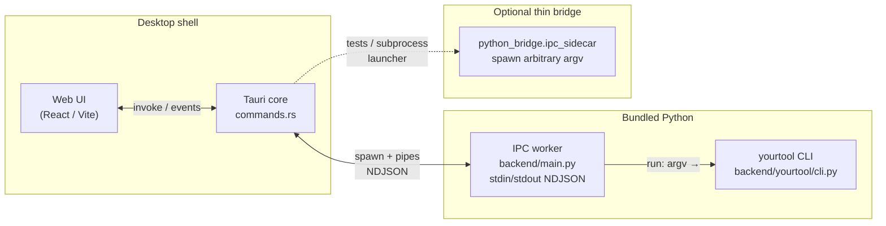

# Architecture

## Shared stack (diagram)

Typical packaging path: **UI → Tauri command → Python worker (`main.py`) → `cli_main(argv)`**. The thin **`ipc_sidecar`** exists for subprocess-shaped workloads and pytest coverage; production builds usually attach directly to the worker loop that executes pipeline commands.

## IPC contracts

Two NDJSON protocols appear in this repo — keep them distinct when debugging.

### Worker protocol (`backend/main.py`)

One JSON object per line on **stdin**; responses on **stdout**. Requests use a **`command`** field:

| `command` | Fields | Behaviour |
|-----------|--------|-----------|
| `ping` | optional `id` | Immediate `result` with `ok`, `version`. |
| `run` | `args.argv`: string list; optional `concurrent`, `args.max_parallel` | Runs `yourtool.cli.main(argv, cancel_event=…)` in a thread pool; streams logs/progress; ends with `result` (`exit_code`) or `error`. |
| `cancel` | `args.target_id` or `args.id` | Sets cooperative cancel event for that run id; responds `result`. |
| `shutdown` | — | Acknowledges and drains worker pool; process exits. |

**Outbound message types** (stdout):

| `type` | Purpose |
|--------|---------|
| `log` | Line-buffered stdout/stderr/`logging`; payload includes `stream`, `line`; logging adds `level`, `logger`. |
| `progress` | Optional tqdm hook: `payload.pct`, `payload.msg`. |
| `result` | Success terminal message for the request id (including run completion). |
| `error` | Structured failure (`code`, `msg`; optional traceback if `PYTOOL_DEBUG=1`). |

Concurrency is gated by a semaphore (`PYTOOL_MAX_PARALLEL`, default 4).

### Thin bridge (`backend/python_bridge/ipc_sidecar.py`)

Tests spawn `python -m python_bridge.ipc_sidecar`. Requests use **`method`**:

| `method` | Notes |
|----------|-------|
| `ping` | Response includes `"event": "pong"`. |
| `run` | `argv`, optional `cwd`; replies `phase: started` then `phase: finished` with truncated `log_lines`. |
| `cancel` | `target_id` references internal `run_id`. |
| `shutdown` | `grace_ms`; kills pending subprocesses after grace. |

Lines larger than **`MAX_LINE_BYTES`** (256 KiB) are rejected.

Host-side adapters (`commands.rs`, `lib/ipc.ts`) should normalize whichever protocol they speak into UI-friendly events.

## Why Tauri instead of Electron

- **Footprint:** Smaller downloads; uses the OS WebView rather than shipping Chromium.
- **Performance:** Rust core for process lifecycle and IPC; less idle RAM than bundling V8 + Node for shell duties.
- **Security posture:** Narrow native surface (capabilities + Rust memory safety) vs embedding full Node.
- **Distribution:** Aligns with platform-native packaging, signing, and updater flows already common for Rust tooling.

Trade-off: WebView behaviour differs slightly per OS — CI should cover macOS, Windows, and at least one Linux desktop.

## Sidecar / worker lifecycle

1. **Startup:** Rust resolves the bundled interpreter path (PyInstaller binary or `python`), sets `PYTHONPATH`/cwd, spawns process with stdin/stdout pipes.
2. **Handshake:** UI or Rust sends `ping`; worker replies with version — gates UI readiness spinners.
3. **Execute:** For each job, Rust allocates a client **`id`**, sends `run` with CLI argv; streams NDJSON until `result`/`error`.
4. **Cancel:** User cancellation sends `cancel` with the active run id; Python sets `threading.Event`; CLI implementations must poll `cancel_event` (see `yourtool.cli`).
5. **Shutdown:** App quit sends `shutdown`, waits bounded time for pools / subprocess cleanup, then kills pipe if hung.

Closing stdin without shutdown should still terminate reader loops (see regression test `test_stdin_closing_stops_sidecar`).

## Progress and log events

- **Stdout/stderr:** Redirected into `_LineForwardingStream`; each newline becomes a **`log`** NDJSON object tagged with the request id.
- **`logging`:** Root logger handler mirrors records into **`log`** with `stream: logging`.
- **Progress:** If `tqdm` is installed and supports `callbacks`, `tqdm.__init__` is patched per request to emit **`progress`** messages (`pct`, `msg`).

Rust reads stdout **line-by-line**, parses JSON, and forwards to the frontend via **Tauri events** or command replies. Never merge worker stdout with unstructured prints — the worker owns the pipe protocol.

## Where state lives

| Layer | State |
|-------|--------|
| **UI** | View state, selected paths, scrollback buffers for logs; ephemeral unless persisted via Rust/store. |
| **Rust** | Child PID/handles, outstanding request ids, cancellation tokens, updater metadata. |
| **Python worker** | `_IPCState`: semaphore for parallelism, `cancel_events` dict, thread pool queueing. |
| **CLI commands** | Pure computation + filesystem side effects under user-provided directories — no shared globals except explicit contexts passed by argparse handlers. |

Treat the NDJSON stream as the single source of truth for remote progress; duplicate caching only for UX (throttled rendering).
